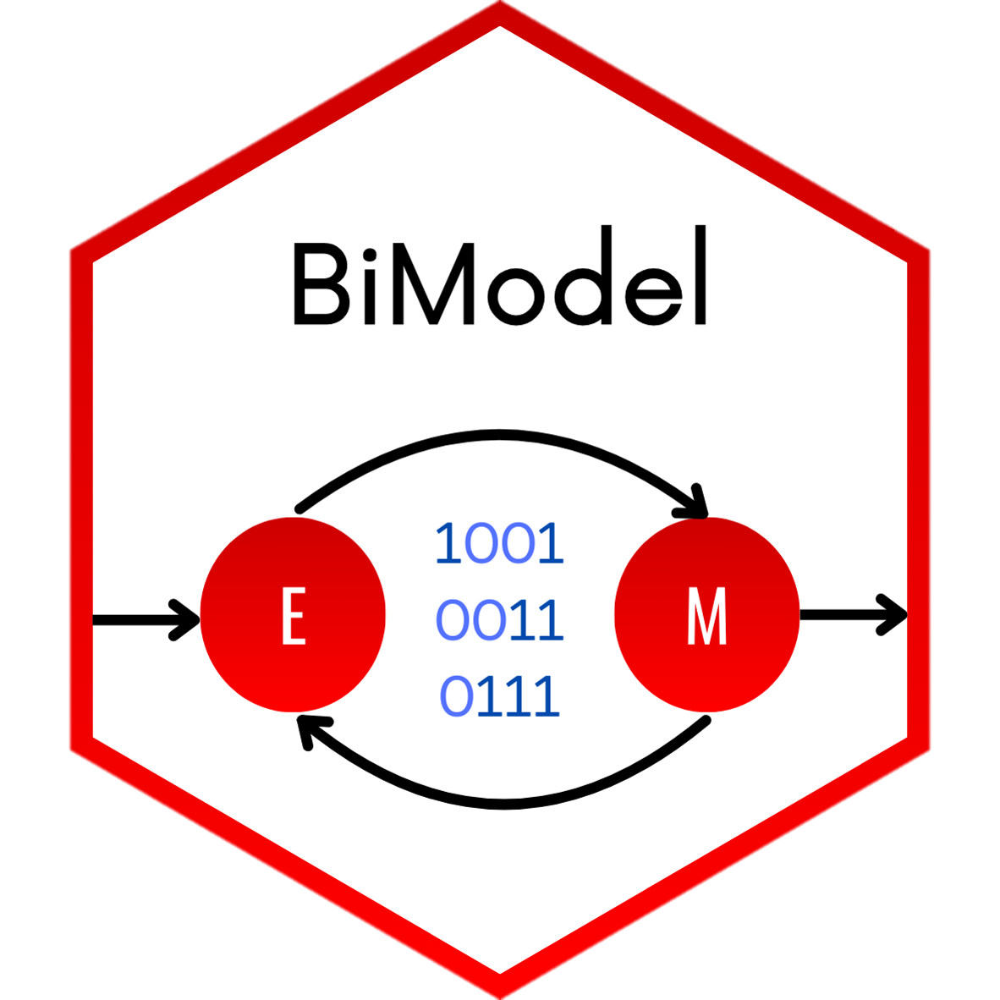

# BiModel 
Here package for binomial distribution mixture model is developing.

## Installation
You can install the package from [GitHub](https://github.com/) with:
``` r
# install.packages("devtools")
devtools::install_github("karowid617/BiModel")
```

## Manual
Loading of library and examplary data.
``` r
library(BiModel)
data(example)
```
Tu można się bawić dalej i coś poopowiadać.


## References
Damy jak opublikujemy

